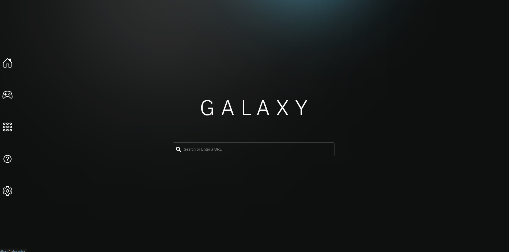
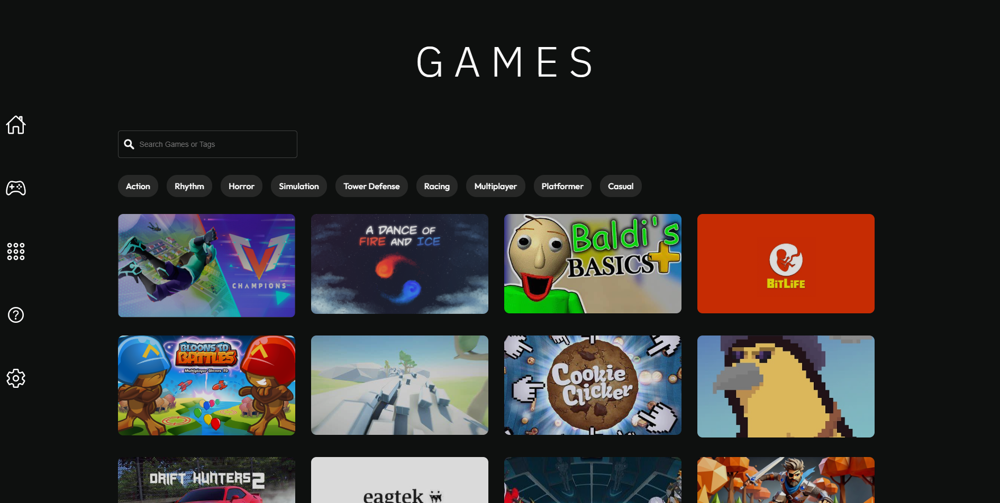
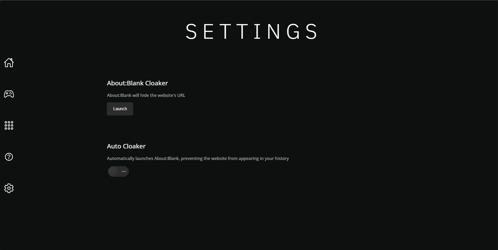

# Galaxy🪐

~Browse the internet with no restrictions

## About Galaxy📑

Galaxy is a minimalistic open source proxy that is capable of evading internet censorship. Galaxy uses Chemical.JS, which is harder to detect and fast. It also contains a vast collection of games that will continuously expand as the site grows. Join [Falcon Networks](https://discord.gg/xM8FvSAttG) for more links!


## Demo 🏴󠁺󠁡󠁦󠁳󠁿

#### https://galacticsurf.boats/

## Run Galaxy Locally 🚀

##### Install Galaxy
```bash
git clone https://github.com/r480github/GalaxyV4.git
cd GalaxyV4
```


<br>

##### Install dependencies

```bash
npm i  
```

##### Start

```bash
npm start
```
#### NOTE: The dafault port for GalaxyV4 is 3000. You can visit it by typing localhost:3000/ into a web browser
<br>
    
## You can also deploy Galaxy on Koyeb(For Free)
[](https://app.koyeb.com/deploy?name=galaxyv4&repository=r480github%2FGalaxyV4&branch=main&instance_type=free&regions=was&instances_min=0&autoscaling_sleep_idle_delay=300&ports=3000%3Bhttp%3B%2F&hc_protocol%5B3000%5D=tcp&hc_grace_period%5B3000%5D=5&hc_interval%5B3000%5D=30&hc_restart_limit%5B3000%5D=3&hc_timeout%5B3000%5D=5&hc_path%5B3000%5D=%2F&hc_method%5B3000%5D=get)<br>
<br>

## A look inside👀
<span style="color:rgb(212, 65, 65)"> Note: GalaxyV4 is still under development and have many more updates to come </span>
<br>

### Home screen



#

### Games



#

### Proxy



## Credits

- [Chemical.js](https://github.com/chemicaljs/chemical)
- [Discord Server](https://discord.gg/xM8FvSAttG)
- [Icons](https://github.com/ionic-team/ionicons)
- [da best dev ever](https://github.com/r480github)
